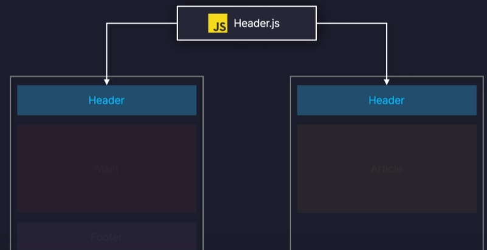

# 깃업로드용

# **📌 Nodejs란?**

---

- Chrome V8 JavaScript 엔진으로 빌드된 JavaScript 런타임 환경 = 자바스크립트 실행 환경 = 구동기
    <aside>
    💡
    
    웹 브라우저 없이도 자바스크립트 코드를 실행할 수 있게 해주는 도구
    
    </aside>

### nodejs 모듈 시스템 이해하기

- 모듈 : 기능별로 나위어진 자바스크립트 파일들
- 모듈 시스템 : 다양한 기능을 제공하는 시스템

js의 모듈 시스템 종류

1. common js

   ```jsx
   // math 모듈
   function add(a, b) {
     return a + b;
   }

   function sub(a, b) {
     return a - b;
   }

   module.export = {
     add,
     sub,
   };

   // index.js
   const { add, sub } = require("./math");

   console.log(add(1, 2));
   console.log(sub(1, 2));
   ```

2. es module

   ```jsx
   // ex module 시스템을 사용하기 위해서는 package.json 파일에

   "type" : "module"

   // 이라고 명시 필요

   // math 모듈
   export function add(a,b) {
   	return a + b;
   }

   export function sub(a,b){
   	return a - b;

   }

   // default를 명시하면 math.js의 기본 함수가 됌.
   export default function multiply {
   	return a * b
   }

   // index.js
   import mul, {add, sub} from './math.js' // es module 시스템을 활용할때는 확장자도 같이 명시

   onsole.log(add(1,2));
   console.log(sub(1,2));
   ```

3. amd
4. umd

# **📌 React 란?**

---

<aside>
💡

Meta에서 개발한 오픈소스 자바스크립트 UI 라이브러리

</aside>

## 핵심 특징

1. 컴포넌트 기반으로 UI 표현

   1. 기술적 특징 컴포넌트를 기반으로 UI를 표현

      

2. 화면 업데이트 구현이 쉽다

   1. 리액트는 선언형 프로그래밍 = 목적만 깔끔하게 명시 (코드가 간결함)

   > 선언형 프로그래밍 : 과정은 생략하고 목적만 간결히 명시하는 방법

   명령형 프로그래밍 : 목적을 이루기 위한 모든 일련의 과정을 설명하는 방식 = 자바스크립트

   >

   

   state 등의 상태가 변하면 자동으로 다른 버전의 UI로 렌더링

3. 화면 업데이트가 빠르게 처리

## 브라우저 렌더링 과정

1. HTML 코드를 해석해 돔으로 변환 & CSS 코드도 해석해 css 오브젝트 모델으로 변환

   

2. 돔과 css모을 합쳐 렌더 트리(Render Tree) 구성

   > DOM ? HTML 문서를 일종의 객체 모델(Document Object Model, DOM)로 변환
   >
   > 예시)
   >
   > 
   >
   > - 웹 브라우저가 HTML 코드를 렌더링하기 위해 직접 생성

3. 렌더 트리 생성 (웹 페이지의 청사진)

   

4. 요소 배치

   

   (렌더 트리 정보를 바탕으로 요소의 위치를 픽셀(px) 단위로 계산) ⇒ 렌더링 과정에서 가장 많은 연산을 요구하는 작업

5. 페인팅

   

   렌더링 과정에서 가장 많은 연산을 요구하는 작업

# **📌 React 컴포넌트**

---

### **마크업으로 뿌릴 수 있는 JavaScript 함수**

<aside>
💡

React 컴포넌트는 일반 JavaScript 함수이지만, **이름은 대문자로 시작.** 그렇지 않으면 작동하지 않음

</aside>

```jsx
const Header = () => {
  return (
    <header>
      <h1>header</h1>
    </header>
  );
};
export default Header;
```

```jsx
const Main = () => {
  return (
    <main>
      <h1>main</h1>
    </main>
  );
};

export default Main;
```

```jsx
const Footer = () => {
  return (
    <footer>
      <h1>footer</h1>
    </footer>
  );
};
export default Footer;
```

```jsx
// App.js
import "./App.css";
import Header from "./components/Header";
import Main from "./components/Main";
import Footer from "./components/Footer";

function App() {
  return (
    <>
      <Header />
      <Main />
      <Footer />
    </>
  );
}

export default App;
```

# **📌 React JSX**

---

### JsvaScript Extensions로 확장된 자바스크립트 문법

- JavaScript 파일을 HTML과 비슷하게 마크업을 작성

기존 html 코드

```jsx
<h1>Hedy Lamarr's Todos</h1>

<ul>
    <li>Invent new traffic lights
    <li>Rehearse a movie scene
    <li>Improve the spectrum technology
</ul>
```

JSX문법 코드

```jsx
export default function TodoList() {
  return (
  // JSX 주의 사항
	// 1. 중괄호 내부에는 자바스크립트 표현식만 넣을 수 있다
	// 2. 숫자, 문자열, 배열 값만 렌더링 된다
	// 3. 모든 태그는 닫혀있어야 한다
	// 4. 최상위 태그는 반드시 하나여야만 한다
   <> // React.Fragment
    <h1>Hedy Lamarr's Todos</h1>
    
    <ul>
      <li>Invent new traffic lights
      <li>Rehearse a movie scene
      <li>Improve the spectrum technology
    </ul>
   </>
  );
}
```

<aside>
💡

한 컴포넌트에서 여러 엘리먼트를 반환하려면, **하나의 부모 태그로 감싸야한다.**

why?

JSX는 HTML처럼 보이지만 내부적으로는 일반 JavaScript 객체로 변환.

하나의 배열로 감싸지 않은 하나의 함수에서는 두 개의 객체를 반환할 수 없기때문에 또 다른 태그나 Fragment로 감싸지 않으면 두 개의 JSX 태그를 반환할 수 없습니다.

</aside>

# **📌 React Props**

---

### Props는 부모 컴포넌트에서 자식 컴포넌트로 데이터를 전달하는 방법

- React 컴포넌트는 props를 이용해 서로 통신
- 부모 컴포넌트는 props를 통해 정보를 자식 컴포넌트에게 전달
- 객체, 배열, 함수를 포함한 모든 JavaScript 값 전달 가능

예시)

```jsx
const Button = ({ text, color, children }) => {
  return (
    <button style={{ color: color }}>
      {text} - {color.toUpperCase()}
      {children}
    </button>
  );
};

Button.defaultProps = {
  color: "black",
};

export default Button;
```

```jsx
import "./App.css";
import Header from "./components/Header";
import Main from "./components/Main";
import Footer from "./components/Footer";
import Button from "./components/Button";

function App() {
  const buttonProps = {
    text: "메일",
    color: "red",
    a: 1,
    b: 2,
    c: 3,
  };
  return (
    <>
      <Button {...buttonProps} />
      <Button text={"카페"} />
      <Button text={"블로그"}>
        <Header />
      </Button>
    </>
  );
}

export default App;
```

# **📌 React State**

---

### 현재 가지고 있는 형태나 모양의 정의 또는 변화할수 있는 동적인 값 = 컴포넌트별 메모리

예시)

```jsx
import "./App.css";
import { useState } from "react";

function App() {
  const [count, setCount] = useState(0);
  const [light, setLight] = useState("OFF");

  return (
    <>
      <div>
        <h1>{light}</h1>
        <button
          onClick={() => {
            setLight(light === "ON" ? "OFF" : "ON");
          }}
        >
          {light === "ON" ? "끄기" : "켜기"}
        </button>
      </div>
      <div>
        <h1>{count}</h1>
        <button
          onClick={() => {
            setCount(count + 1);
          }}
        >
          +
        </button>
      </div>
    </>
  );
}

export default App;
```

# **📌 React useRef**

---

### 새로운 레퍼런스 객체를 생성하는 기능

```jsx
import { useRef } from "react";

// 특정 DOM 요소에 접근하여 조작가능
const ref = useRef();
```

**핵심 특징:**

1. **렌더링 사이에 값을 유지** - 컴포넌트가 재렌더링되어도 값이 사라지지 않음
2. **변경해도 재렌더링 안 됨** - `ref.current`를 바꿔도 화면이 다시 그려지지 않음
3. **항상 같은 객체 참조** - 매 렌더링마다 같은 객체를 반환

- useState와 useRef의 차이점
  | 특징 | useState | useRef |
  | --------------------------- | -------------------- | ------------------------ |
  | **값 변경 시 재렌더링** | ✓ 재렌더링 발생 | ✗ 재렌더링 없음 |
  | **값이 렌더링 사이에 유지** | ✓ 유지됨 | ✓ 유지됨 |
  | **값 접근 방법** | `state` | `ref.current` |
  | **값 변경 방법** | `setState(newValue)` | `ref.current = newValue` |
  | **변경 시점** | 비동기 (다음 렌더링) | 동기 (즉시) |
  | **화면 표시 여부** | 화면에 표시해야 함 | 화면에 표시 안 해도 됨 |
  | **주 용도** | UI 상태 관리 | DOM 참조, 타이머 ID 등 |
  | | | |

# **📌 React Hooks**

---

### 클래스 컴포넌트 기능을 함수 컴포넌트에서도 이용가능 있도록 도와주는 메서드

Hook = 낚아채다 (class 컴포넌트의 기능을 낚아채서 사용한다라는 느낌)

```jsx
// Hooks 이전 (클래스 컴포넌트만 가능)class Counter extends Component {
  state = { count: 0 };

  render() {
    return <div>{this.state.count}</div>;
  }
}

// Hooks 이후 (함수형 컴포넌트에서 가능!)function Counter() {
  const [count, setCount] = useState(0);

  return <div>{count}</div>;
}
```

### **hook 규칙**

- 최상위(at the Top Level)에서만 Hook을 호출.

  ```jsx
  // ❌ 나쁜 예 1: 조건문 안에서 Hook 호출function Bad({ shouldFetch }) {
    if (shouldFetch) {
      const [data, setData] = useState(null);// 오류!
    }
    return <div>Bad</div>;
  }

  // ❌ 나쁜 예 2: 반복문 안에서 Hook 호출function Bad() {
    for (let i = 0; i < 3; i++) {
      const [count, setCount] = useState(0);// 오류!
    }
    return <div>Bad</div>;
  }

  // ❌ 나쁜 예 3: 중첩 함수 안에서 Hook 호출function Bad() {
    const doSomething = () => {
      const [value, setValue] = useState(0);// 오류!
    };
    return <div>Bad</div>;
  }

  // ✅ 좋은 예: 컴포넌트 최상위에서 호출function Good({ shouldFetch }) {
    const [data, setData] = useState(null);// ✓ 최상위const [count, setCount] = useState(0);// ✓ 최상위if (shouldFetch) {
  // 조건부로 사용은 OKsetData("hello");
    }

    return <div>Good</div>;
  }

  ```

- 렌더링 시 항상 동일한 순서로 호출 되어야 합니다.
- Hook은React 함수 내에서만 호출. = 함수형 컴포넌트에서 호출해야 하며, 추가적으로 custom hooks에서 또한 호출이 가능

  ```jsx
  // ❌ 나쁜 예 1: 일반 JavaScript 함수에서 호출function regularFunction() {
    const [state, setState] = useState(0);// 오류!return state;
  }

  // ❌ 나쁜 예 2: 클래스 컴포넌트에서 호출class MyComponent extends Component {
    render() {
      const [count, setCount] = useState(0);// 오류!return <div>{count}</div>;
    }
  }

  // ❌ 나쁜 예 3: 이벤트 핸들러에서 호출function Bad() {
    const handleClick = () => {
      const [count, setCount] = useState(0);// 오류!
    };

    return <button onClick={handleClick}>클릭</button>;
  }

  // ✅ 좋은 예 1: 함수형 컴포넌트에서 호출function GoodComponent() {
    const [count, setCount] = useState(0);// ✓return <div>{count}</div>;
  }

  // ✅ 좋은 예 2: Custom Hook에서 호출function useCustomHook() {
    const [count, setCount] = useState(0);// ✓return count;
  }
  ```

커스텀 훅

예시)

```jsx
import { useState } from "react";

function useInput() {
  const [input, setInput] = useState("");

  const onChange = (e) => {
    setInput(e.target.value);
  };

  return [input, onChange];
}

export default useInput;
```
